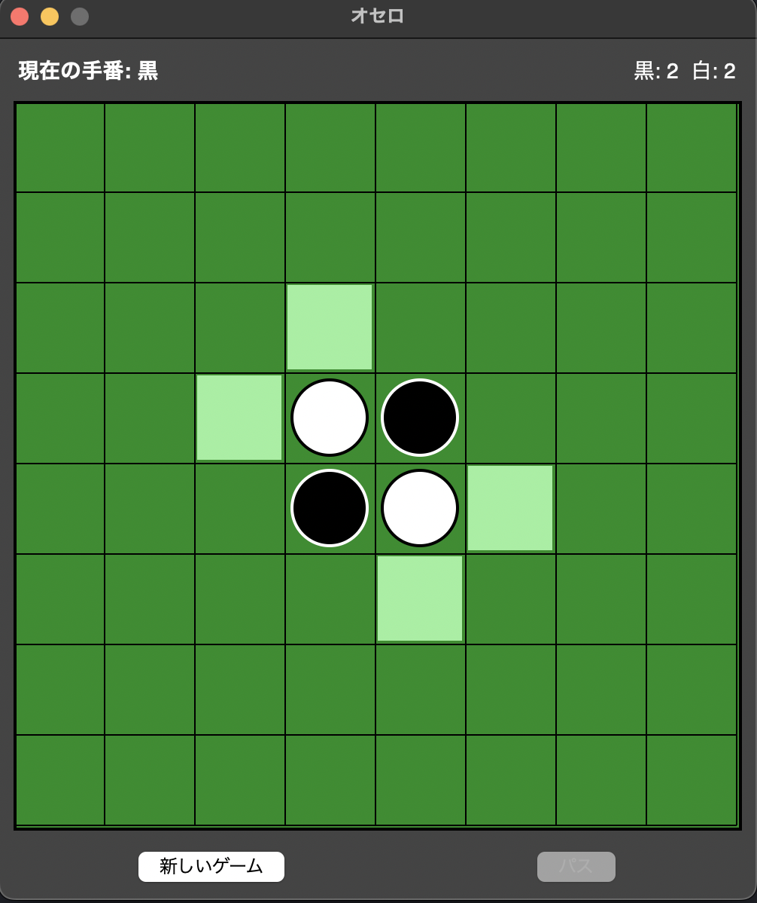

# オセロ（リバーシ）ゲーム

Python と tkinter で作成したオセロ（リバーシ）ゲームです。


## 概要

シンプルで直感的なGUIを持つオセロゲームです。2人対戦で遊ぶことができます。

## 機能

- 8x8 の標準的なオセロボード
- 有効な手のハイライト表示（薄緑色でマス目を表示）
- 現在の手番表示
- リアルタイムスコア表示
- パス機能（置ける場所がない場合）
- ゲームリセット機能
- ゲーム終了時の勝敗表示

## スクリーンショット



## 必要条件

- Python 3.9 以上
- tkinter（Python標準ライブラリ）

## インストール

```bash
# リポジトリをクローン
git clone https://github.com/San/othello_tkinter.git

# ディレクトリに移動
cd othello_tkinter
```

## 使い方

```bash
python othello.py
```

## ゲームルール

1. **初期配置**: ゲーム開始時、中央の4マスに黒と白の石が2つずつ交互に配置されます
2. **手番**: 黒が先手で、交互に石を置きます
3. **石の配置**: 相手の石を自分の石で挟める位置にのみ石を置けます
4. **反転**: 石を置くと、挟まれた相手の石が全て自分の色に反転します
5. **パス**: 置ける場所がない場合はパスとなります
6. **終了条件**: 両者とも置ける場所がなくなった時点でゲーム終了
7. **勝敗**: 石の数が多い方が勝ち

## プロジェクト構成

```
othello_tkinter/
├── .editorconfig           # エディタ設定
├── .github/
│   ├── ISSUE_TEMPLATE/
│   │   ├── bug_report.md       # バグ報告テンプレート
│   │   └── feature_request.md  # 機能リクエストテンプレート
│   ├── PULL_REQUEST_TEMPLATE.md
│   ├── dependabot.yml          # 依存関係自動更新
│   └── workflows/
│       └── python-test.yml     # CI/CD
├── .gitignore              # Git除外設定
├── CHANGELOG.md            # 変更履歴
├── CODE_OF_CONDUCT.md      # 行動規範
├── CONTRIBUTING.md         # 貢献ガイド
├── LICENSE                 # MITライセンス
├── Makefile                # コマンド簡略化
├── README.md               # このファイル
├── SECURITY.md             # セキュリティポリシー
├── othello.py              # メインプログラム
├── pyproject.toml          # パッケージ設定
├── requirements.txt        # 依存関係
├── screenshots/            # スクリーンショット用
└── tests/
    ├── __init__.py
    └── test_othello.py     # ユニットテスト
```

## 技術的な特徴

- **オブジェクト指向設計**: ゲームロジック（`OthelloGame`）とGUI（`OthelloGUI`）を分離
- **型ヒント**: Python 3.9以降の型ヒントを使用
- **クリーンなコード**: PEP 8に準拠したコーディングスタイル

## ライセンス

このプロジェクトは MIT ライセンスの下で公開されています。詳細は [LICENSE](LICENSE) ファイルを参照してください。

## 作者

San

## 貢献

バグ報告や機能リクエストは、Issue でお知らせください。プルリクエストも歓迎します。

1. このリポジトリをフォーク
2. 新しいブランチを作成 (`git checkout -b feature/amazing-feature`)
3. 変更をコミット (`git commit -m 'Add some amazing feature'`)
4. ブランチにプッシュ (`git push origin feature/amazing-feature`)
5. プルリクエストを作成
